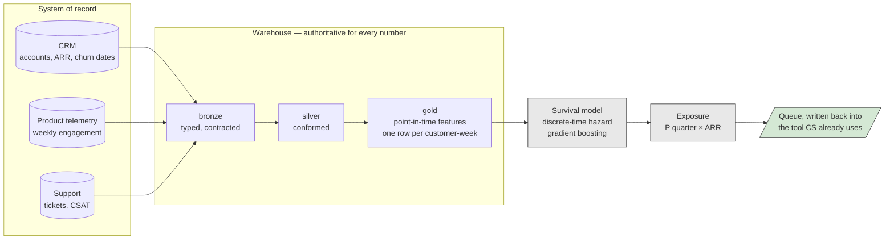
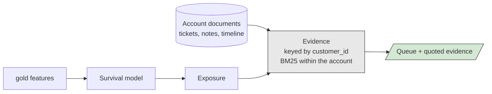
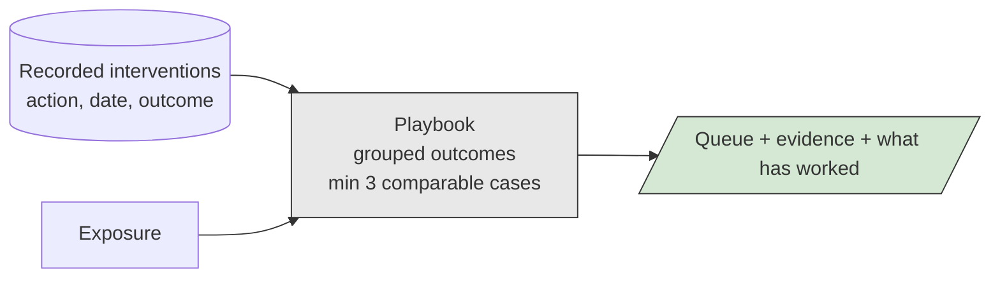
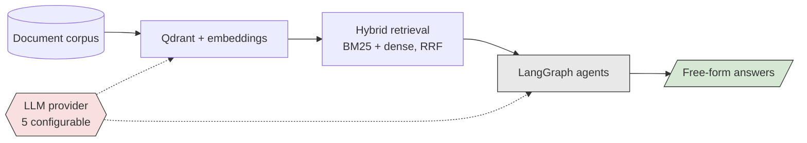

# Minimum viable architecture

**2026-09-01 · Companion to [`ARCHITECTURE.md`](ARCHITECTURE.md), which describes the full system**

The smallest thing that delivers value, what it costs to run, and what each
additional tier buys. Written for the scoping conversation, where the useful
question is not "what could we build" but "what is the least we can build that a
customer would keep paying for".

## The finding

**The minimum viable architecture contains no LLM.**

Detect, value, and explain — the entire chain from raw telemetry to an evidenced
recommendation — is warehouse, gradient boosting, and BM25. Not by preference, but
because that is what the measurements support.

This is measured, not asserted. With no `OPENAI_API_KEY` and no vector database
running, **11 of 12 GET routes serve fully**, including likelihood, exposure,
evidence and plays. One free-form question endpoint returns 503 with a specific
reason. (The twelfth, `/evaluation-results`, returns 500 — see Known issues.)

For an "AI project" that is worth stating plainly in a scoping meeting, because it
changes the cost, the procurement conversation and the failure modes all at once.

## Tier 0 — the MVA

**Delivers:** a weekly queue of accounts ranked by expected ARR at risk, in the
tool the team already opens.

**Requires:** survey items D1, D2, D3, V1, V2. No LLM, no vector store, no GPU.

**Why this is the floor rather than something smaller:** the exposure step is what
makes the queue a decision instead of a report. A ranked list without money on it
gets read once. Ranking by likelihood and ranking by exposure produce genuinely
different lists — in this dataset a Low-band account is the 9th largest exposure
because its ARR is $487k — and the second is the one a team with finite hours
needs.

**Why the writeback rather than a dashboard:** the standard failure of this product
category is a dashboard nobody opens. Delivery into the existing workflow is
cheaper than a console and adopted more often.

## Tier 1 — explanation

**Adds:** every entry in the queue carries quoted, attributed passages from that
account's own record.

**Requires:** D5 free text. Still **no LLM and no vector store.**

Selection is by key, then BM25 ranking inside that account's ~5 documents. Returning
another account's story is structurally unreachable, which was the original failure
of the general Q&A path. Embedding similarity would reintroduce it for no gain at
this document count.

**Why this tier is worth its cost:** a score that cannot be argued with is either
believed uncritically or ignored. Evidence is what turns the queue from an
instruction into an argument, and it is nearly free.

## Tier 2 — recommendation

**Adds:** what has worked on comparable accounts, with case counts and measured
effect.

**Requires:** survey item **D6, which most customers fail.** Still no LLM — the
plays are grouped aggregates, deliberately not generated.

**Why it is a separate tier rather than part of the product:** it depends on data
almost nobody has, and if scoped into phase one it either slips or gets faked. An
LLM asked for a retention tactic produces fluent advice with nothing behind it,
which is the exact failure this system exists to avoid. Cut it, and propose the
outcome logging that makes it buildable in two quarters.

## Tier 3 — open question answering

**Adds:** questions the structured views do not anticipate.

**Requires:** an LLM provider, an embedding model, a running vector store, and a
procurement answer about where customer data may go.

*Measured:* hybrid retrieval reaches 0.971 single-entity hit rate against 0.735 for
dense-only — a real improvement, on the tier that costs the most to run.

**This is the tier to defer, and saying so is the point.** It carries all of the
per-request cost, all of the data-residency exposure, and all of the
non-determinism, in exchange for a capability that is not what the buyer described
in the first meeting. Build it when someone asks for it twice.

## Cost and risk by tier

| Tier | Runtime cost | Determinism | Data leaves host | Blocking survey items |
|---|---|---|---|---|
| **0 · Detect + value** | Warehouse compute only | Fully deterministic | No | D1, D2, D3, V1, V2 |
| **1 · Explain** | Negligible | Fully deterministic | No | + D5 |
| **2 · Recommend** | Negligible | Fully deterministic | No | + D6 |
| **3 · Ask** | Per request | Non-deterministic | **Yes, unless local** | + procurement |

Tiers 0–2 give identical output on every request, which matters more than it
sounds: it is what makes the numbers reconcilable against SQL, testable in CI, and
defensible when a customer disputes one.

Tier 3 is configurable across five providers via `LLM_PROVIDER`, including a fully
local one, and `/health` reports `data_leaves_host`. So a "no hosted LLM" answer in
the survey is a configuration change rather than a re-architecture — but the
cheaper answer is usually that the customer does not need tier 3 yet.

## What this means for a first engagement

Scope **tier 0 and tier 1**. They are the whole value proposition, they are
deterministic, they carry no per-request cost, and they clear procurement without
a data-residency conversation.

Quote tier 2 as contingent on D6, and tier 3 as a later phase. A proposal that
leads with agents and vector databases is describing the most expensive and least
certain third of the system as though it were the product.

## Known issues affecting this document

- `/evaluation-results` returns **500** rather than the 404 it intends: a bare
  `except Exception` catches the deliberately raised `HTTPException` and re-emits
  it. Found 2026-09-01 while measuring the no-LLM route count. Recorded in
  `STATUS.md`; unfixed, out of scope for 5.3.
- The layer diagram in `ARCHITECTURE.md` still shows the presentation layer serving
  a "predicted churn date and interval". That was retracted by **ADR-0009**. The
  diagram is annotated rather than rewritten, so the supersession stays visible.
